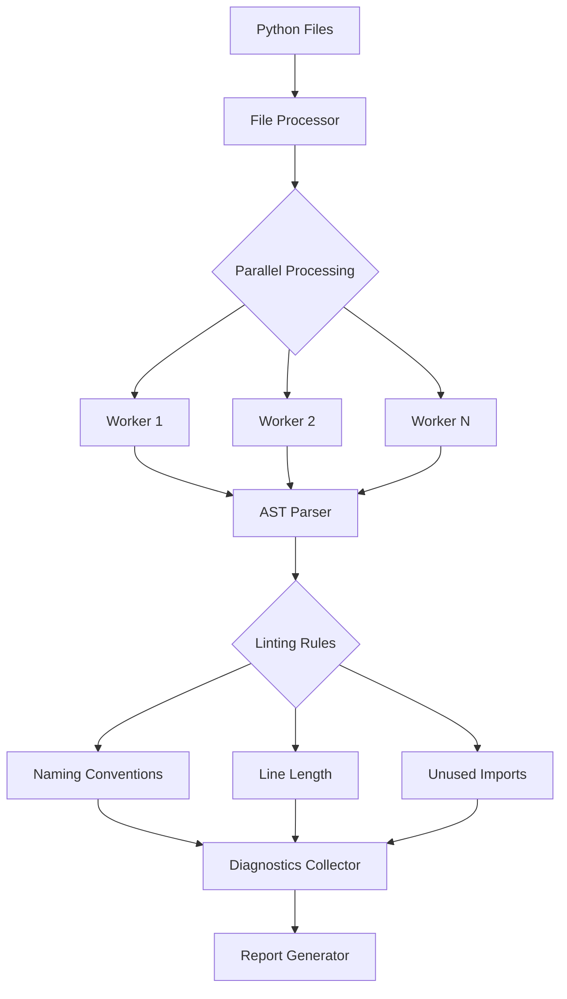
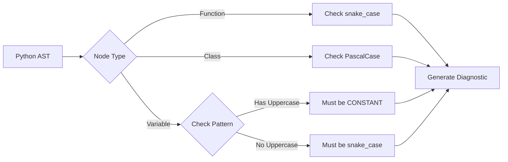
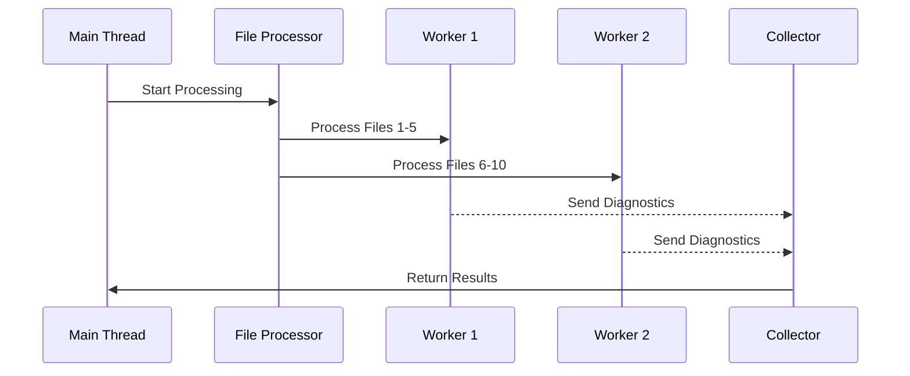
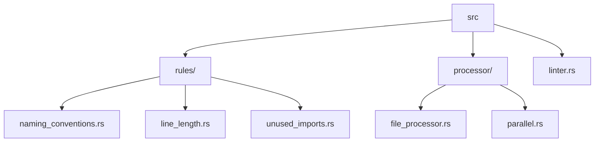

# RustLint: High-Performance Python Linter

RustLint is a cutting-edge Python linter developed using Rust, designed to deliver exceptional performance, robust error detection, and intelligent code analysis. By leveraging Rust's speed and safety features, RustLint provides fast and accurate Python code analysis with intelligent suggestions.

## Architecture

### High-Level Overview



### Naming Conventions Rule Flow



### Parallel Processing Implementation



## Features

- **High-Performance Syntax Checking**: Fast and accurate Python code analysis using RustPython parser
- **Naming Convention Validation**:
  - Function names must use `snake_case`
  - Class names must use `PascalCase`
  - Variable names must use either `snake_case` or `UPPER_CASE` for constants
- **Code Style Checks**:
  - Line length validation
  - Unused imports detection
  - PEP 8 compliance verification
- **Performance Features**:
  - Concurrent file processing
  - Efficient AST traversal
  - Zero-copy string handling
- **Developer Experience**:
  - Detailed error messages
  - Source location tracking
  - Configurable rules

## Installation

```bash
# Coming soon - will be available via cargo install
cargo install rustlint
```

## Usage

```bash
# Lint a single file
rustlint file.py

# Lint an entire directory
rustlint /path/to/project

# Use specific configuration
rustlint --config path/to/config.toml file.py
```

## Configuration

RustLint can be configured using a `rustlint.toml` file in your project root:

```toml
[rules]
max_line_length = 88
ignore_unused_variables = false
strict_pep8 = true

[paths]
exclude = ["venv/*", "build/*"]
```

## Implemented Rules

### 1. Naming Conventions
- Functions must use `snake_case` (e.g., `calculate_total`)
- Classes must use `PascalCase` (e.g., `BankAccount`)
- Variables must use either:
  - `snake_case` for regular variables (e.g., `user_count`)
  - `UPPER_CASE` for constants (e.g., `MAX_RETRIES`)

Example:
```python
# Good
class BankAccount:
    MAX_BALANCE = 1000000
    
    def transfer_money(self, amount):
        current_balance = self.get_balance()
        # ...

# Bad
class bankAccount:  # Should be PascalCase
    Max_Balance = 1000000  # Should be UPPER_CASE
    
    def TransferMoney(self, amount):  # Should be snake_case
        Current_Balance = self.get_balance()  # Should be snake_case
```

### 2. Line Length
- Configurable maximum line length (default: 88 characters)
- Smart handling of comments and docstrings

### 3. Unused Imports
- Detection of unused import statements
- Support for aliased imports
- Handling of `from module import *` statements

## Development

### Prerequisites

- Rust (latest stable)
- Python 3.7+
- Cargo

### Building from Source

```bash
git clone https://github.com/yourusername/rustlint.git
cd rustlint
cargo build --release
```

### Running Tests

```bash
cargo test
```

## Project Structure



## License

This project is licensed under the MIT License - see the LICENSE file for details.
